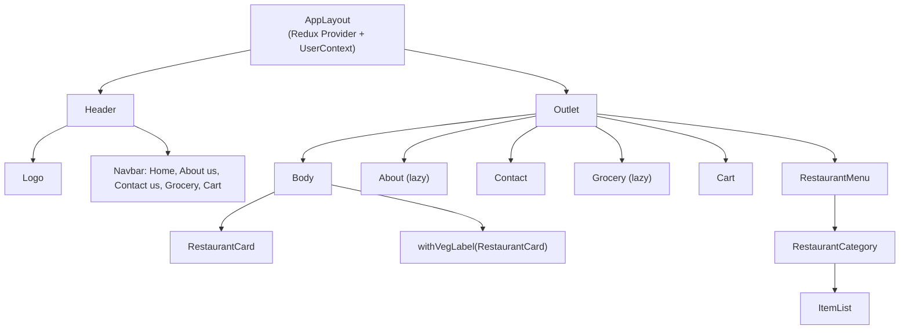
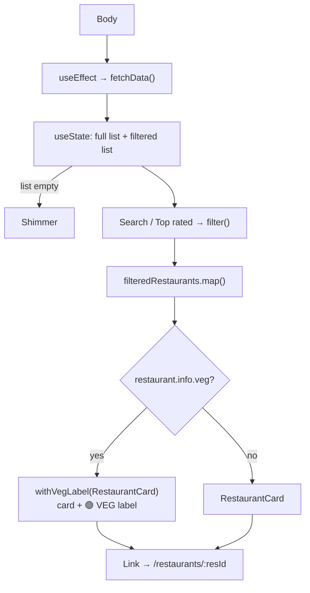
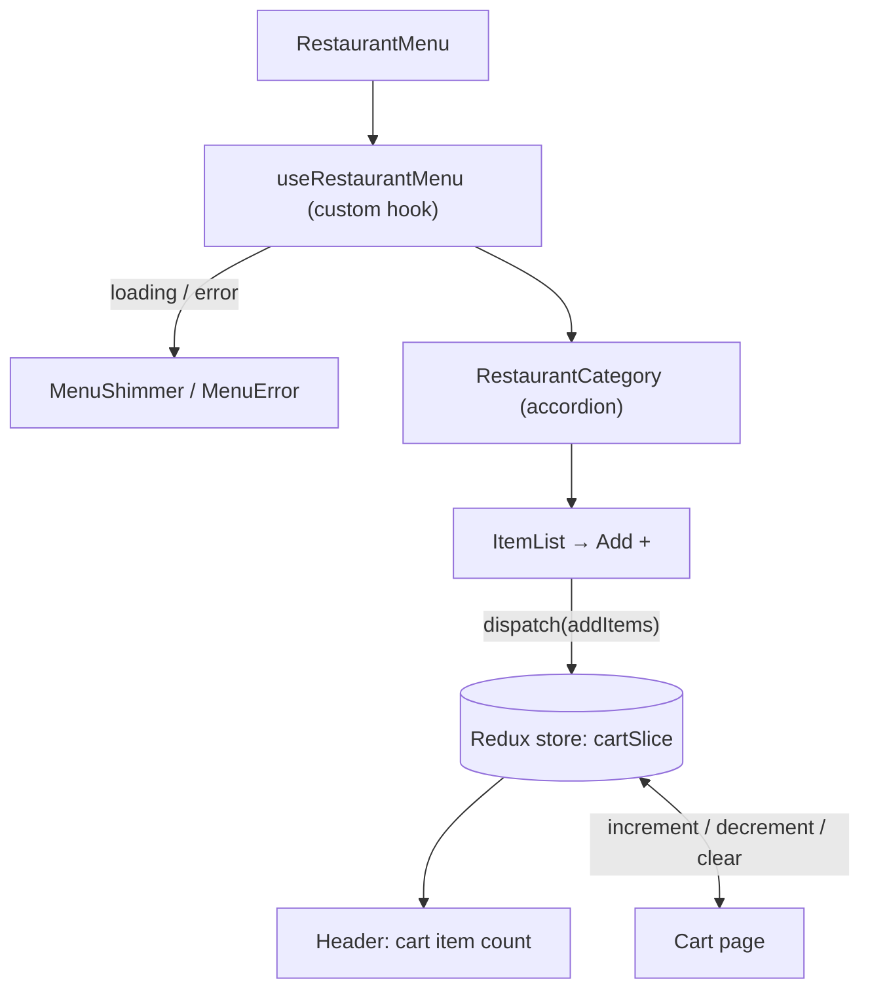

<div align="center">

# 🍽️ FoodieHub

### A food ordering web app built with React: browse restaurants, explore menus, and fill your cart.

<p>
  <a href="https://foodiehub-k3304-x7p9.vercel.app/" target="_blank" rel="noopener noreferrer">
    
  </a>

  <a href="https://karan3304.github.io/FoodieHub/" target="_blank" rel="noopener noreferrer">
    
  </a>
</p>

<p>
  
</p>

<p>
  
  
  
  
  
  
</p>

</div>


---

## 📖 About the project

**FoodieHub** is a single-page food ordering app in the style of Swiggy/Zomato. A user lands on a grid of restaurants, searches or filters them, opens a restaurant to see its menu grouped by category, adds dishes to a cart, and adjusts quantities on a dedicated cart page.

The project is also a hands-on showcase of core **React patterns**, each used for a real purpose in the app:

| Pattern | Where it's used |
| --- | --- |
| **Higher-Order Component** | `withVegLabel(RestaurantCard)` adds a 🟢 VEG badge to vegetarian restaurants |
| **Custom hooks** | `useRestaurantMenu` (menu fetching) and `useOnlineStatus` (offline detection) |
| **Redux Toolkit** | A `cartSlice` holds cart items and quantities, shared by Header and Cart page |
| **Context API** | `UserContext` shares the logged-in user name across components |
| **Lazy loading + Suspense** | `About` and `Grocery` pages load only when visited |
| **Conditional rendering** | Shimmer placeholders, offline message, error pages |
| **Lifting state up** | `RestaurantMenu` controls which menu category is open |
| **Testing** | Jest + React Testing Library tests with mocked API data |

---

## ✨ Features

- 🏠 **Restaurant listing:** live data fetched from an API and shown as cards (image, cuisines, rating, delivery time, cost for two)
- 🔍 **Search:** filter restaurants by name
- ⭐ **Top rated filter:** show only restaurants rated above 4.2
- 🟢 **Veg label:** vegetarian restaurants automatically get a VEG badge via a higher-order component
- 📋 **Restaurant menu:** dishes grouped into collapsible categories (accordion, one open at a time)
- 🛒 **Cart:** add dishes, increase or decrease quantity, clear the cart, and see the live item count in the header
- 📶 **Online status indicator:** green or red in the header, plus an offline message in the app
- ⏳ **Shimmer loading UI:** skeleton screens while data loads (`Shimmer`, `MenuShimmer`)
- ⚠️ **Error handling:** dedicated pages for bad routes (`Error`) and failed menu requests (`MenuError`)
- ⚡ **Code splitting:** lazy-loaded About and Grocery pages
- 🧪 **Tested:** component tests for Header, Search, Restaurant card, Contact and Cart flows

---

## 🧩 How it works

### Component architecture



### Restaurant listing flow (Body)



### Menu and cart flow (Redux)



---

## 🛠️ Tech stack

| Layer | Technology |
| --- | --- |
| UI library | React 19 |
| Routing | React Router DOM 6 (`createBrowserRouter`, nested routes, `Outlet`) |
| State management | Redux Toolkit + React Redux, plus Context API |
| Styling | Tailwind CSS 4 (via PostCSS) |
| Bundler | Parcel 2 |
| Testing | Jest 30, React Testing Library, jest-environment-jsdom |
| Data | REST API (restaurant list and menu endpoints) |

---

## 📁 Project structure

```
FoodieHub/
├── index.html
├── index.css                  # Tailwind entry
├── package.json
├── babel.config.js
├── jest.config.js
└── src/
    ├── App.js                 # Router, layout, providers
    ├── components/
    │   ├── Header.js          # Logo, nav links, online status, cart count
    │   ├── Body.js            # Restaurant list, search, filters
    │   ├── RestaurantCard.js  # Card + withVegLabel HOC
    │   ├── RestaurantMenu.js  # Menu page
    │   ├── RestaurantCategory.js  # Accordion section
    │   ├── ItemList.js        # Dishes + Add button
    │   ├── Cart.js            # Cart page
    │   ├── Shimmer.js / MenuShimmer.js
    │   ├── Error.js / MenuError.js
    │   ├── About.js / UserClass.js   # Class component demo
    │   ├── Contact.js
    │   ├── Grocery.js
    │   ├── mocks/             # JSON mock data for tests
    │   └── __tests__/         # Jest + RTL tests
    └── utils/
        ├── appStore.js        # Redux store
        ├── cartSlice.js       # Cart reducers
        ├── UserContext.js     # Context
        ├── useRestaurantMenu.js
        ├── useOnlineStatus.js
        └── constants.js       # API URLs and image CDN
```

---

## 🚀 Getting started

### Prerequisites

- [Node.js](https://nodejs.org/) 18 or newer
- npm (comes with Node.js)

### Installation

```bash
# 1. Clone the repository
git clone https://github.com/Karan3304/FoodieHub.git

# 2. Move into the project
cd FoodieHub

# 3. Install dependencies
npm install

# 4. Start the dev server
npm start
```

Parcel will print a local URL (usually `http://localhost:1234`). Open it in your browser.

### Available scripts

| Command | What it does |
| --- | --- |
| `npm start` | Runs the app in development with hot reload |
| `npm run build` | Creates an optimized production build |
| `npm test` | Runs all Jest tests (with coverage) |
| `npm run watch-test` | Runs tests in watch mode |

---

## 🧪 Testing

Tests live in `src/components/__tests__/` and use mocked `fetch` responses from `src/components/mocks/`.

```bash
npm test
```

They cover rendering the restaurant card, searching restaurants, header behavior, the contact page, and the full add-to-cart flow across the menu, header and cart page.

---

## 🌐 API note

The app reads restaurant and menu data from a hosted API (see `src/utils/constants.js` and `Body.js`). If the server is on a free hosting tier, the first request after a quiet period can take a few seconds. The shimmer screen is shown while it wakes up.

---

## 🗺️ Roadmap ideas

- [ ] Real authentication instead of the demo Login/Logout button
- [ ] Persist the cart (localStorage or a backend)
- [ ] Checkout and order summary page
- [ ] Veg-only and cuisine filters
- [ ] Replace the demo About and Grocery pages with real content
- [ ] Screenshots or a live demo link in this README

---

## 🤝 Contributing

Contributions, issues and feature requests are welcome. Feel free to open an [issue](https://github.com/Karan3304/FoodieHub/issues) or submit a pull request.

---

## 👤 Author

**Karan**
GitHub: [@Karan3304](https://github.com/Karan3304)

---

<div align="center">

If you like this project, give it a ⭐ on GitHub!

</div>
